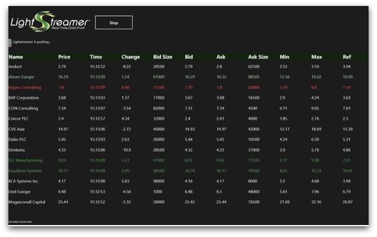

# Lightstreamer - Basic Stock-List Demo - Windows Phone Client

<!-- START DESCRIPTION lightstreamer-example-stocklist-client-winphone -->

This project contains a demo client showing integration between [Lightstreamer Windows Phone Client](http://www.lightstreamer.com/docs/client_windowsphone_api/frames.html) and the Windows Phone platform.

## Live Demo

 
###[ View live demo](zune://navigate?phoneAppID=2cf8750d-ab7f-e011-986b-78e7d1fa76f8) 

## Details

This is a Windows Phone version of the [Stock-List Demos](https://github.com/Weswit/Lightstreamer-example-Stocklist-client-javascript). 
This app uses the <b>Windows Phone Client API for Lightstreamer</b>, based on Silverlight, to handle the communications with Lightstreamer Server. A simple user interface is implemented to display the real-time data received from Lightstreamer Server.

In particular, this readme file details the steps required in order to execute the demo together with the Windows Phone emulator contained in Visual Studio (Express) for Windows Phone.

### Dig the Code

* `App.xaml.cs` is the main application file, it contains application events handling code (application launching, closed, activated, etc), Lightstreamer Client streaming controls (start, stop) and part of the auto-reconnection logic required when connection quality is weak.
* `MainPage.xaml.cs` is the place where all the application widgets are handled. The application in fact, consists in a simple table containing real-time (simulated) stock quotes, whose cells are kept up-to-date by implementing the ILightstreamerListener interface.
  Several lines in this file are dedicated to the animation code used for highlighting cells in case of real-time updates, you can ignore them altogether if you feel more comfortable.
* `LightstreamerClient.cs` is a simple wrapper for LSClient public class (see Lightstreamer Silverlight API) and uses two listeners: `StocklistConnectionListener.cs` and `StocklistHandyTableListener.cs`, respectively implementing a Connection Status listener and a Real-Time Data Updates listener.

Check out the sources for further explanations. 
  
<i>NOTE: not all the functionalities of the Lightstreamer Windows Phone Demo are exposed by the classes listed above. You can easily expand those functionalities using the Silverlight Client API as a reference. 
If in trouble check out the [specific Lightstreamer forum](http://forums.lightstreamer.com/forumdisplay.php?34-Windows-Phone-Client-API).</i>

<!-- END DESCRIPTION lightstreamer-example-stocklist-client-winphone -->

## Install

If you want to install a version of this demo pointing to your local Lightstreamer server, follow these steps:

* Note that, as prerequisite, the [Lightstreamer - Stock- List Demo - Java Adapter](https://github.com/Weswit/Lightstreamer-example-Stocklist-adapter-java) has to be deployed on your local Lightstreamer Server instance. Please check out that project and follow the installation instructions provided with it.
* Launch Lightstreamer Server.
* Download the `deploy.zip` file that you can find in the [deploy release](https://github.com/Weswit/Lightstreamer-example-StockList-client-winphone/releases) of this project and extract the `WPStockListDemo.xap` file.
* Deploy the `WPStockListDemo.xap` in your Windows Phone Emulator, please follow the instructions specific for your version.
* Launch the *Lightstreamer Demo* app (please note that the demo try to connect to http://localhost:8080).

## Build

To build your own version of `WPStockListDemo.xap`, instead of using the one provided in the `deploy.zip` file from the [Install](https://github.com/Weswit/Lightstreamer-example-StockList-client-winphone#install) section above, follow these steps.

* To directly import the project as is you can use Microsoft Visual Studio 2010 Express for Windows Phone. You can download it from the [Microsoft website](http://www.microsoft.com/express/Phone/). <i>NOTE: You may also use the sources of the demo with another IDE or without any IDE but such approach is not covered in this readme.</i>
* You may run the demo against your local server or using our online server at http://push.lightstreamer.com:80. The server to which the demo will connect to is configured in the `App.xaml.cs` file.
  * In the former case, note that, as prerequisite, the [Lightstreamer - Stock- List Demo - Java Adapter](https://github.com/Weswit/Lightstreamer-example-Stocklist-adapter-java) has to be deployed on your local Lightstreamer Server instance. Please check out that project and follow the installation instructions provided with it.
* You should complete this project with the Lightstreamer Windows Phone Client Library, to be used for the build process. Please, download the [latest Lightstreamer distribution](http://www.lightstreamer.com/download/) and copy the `WindowsPhoneClient.dll` and `WindowsPhoneClient.pdb` files from the *Lightstreamer Windows Phone Client SDK* (that is located under the `/DOCS-SDKs/sdk_client_windows_phone/lib` folder) into the `lib` folder of this project.
* You're now ready to import the project into Visual Studio, click on <b>New Project->Windows Phone Application</b> and import all the files located in this demo.
* From Visual Studio, click on the *WP7StockListDemo* project in the Solution Explorer menu and press the "Run (debug)" button. The Windows Phone Emulator will be started and the application loaded.

## See Also

### Lightstreamer Adapters Needed by This Demo Client

<!-- START RELATED_ENTRIES -->
* [Lightstreamer - Stock- List Demo - Java Adapter](https://github.com/Weswit/Lightstreamer-example-Stocklist-adapter-java)
* [Lightstreamer - Reusable Metadata Adapters- Java Adapter](https://github.com/Weswit/Lightstreamer-example-ReusableMetadata-adapter-java)

<!-- END RELATED_ENTRIES -->
### Related Projects ##

* [Lightstreamer - Stock-List Demos - HTML Clients](https://github.com/Weswit/Lightstreamer-example-Stocklist-client-javascript)
* [Lightstreamer - Basic Stock-List Demo - jQuery (jqGrid) Client](https://github.com/Weswit/Lightstreamer-example-StockList-client-jquery)
* [Lightstreamer - Stock-List Demo - Dojo Toolkit Client](https://github.com/Weswit/Lightstreamer-example-StockList-client-dojo)
* [Lightstreamer - Basic Stock-List Demo - Java SE (Swing) Client](https://github.com/Weswit/Lightstreamer-example-StockList-client-java)
* [Lightstreamer - Basic Stock-List Demo - .NET Client](https://github.com/Weswit/Lightstreamer-example-StockList-client-dotnet)
* [Lightstreamer - Stock-List Demos - Flex Clients](https://github.com/Weswit/Lightstreamer-example-StockList-client-flex)
* [Lightstreamer - Basic Stock-List Demo - Silverlight Client](https://github.com/Weswit/Lightstreamer-example-StockList-client-silverlight)
* [Lightstreamer - Basic Stock-List Demo - WinRT Client](https://github.com/Weswit/Lightstreamer-example-StockList-client-winrt)

## Lightstreamer Compatibility Notes

- Compatible with Lightstreamer Windows Phone Client Library version 1.1 or newer.
- For Lightstreamer Allegro (+ Windows Phone Client API support), Presto, Vivace.
